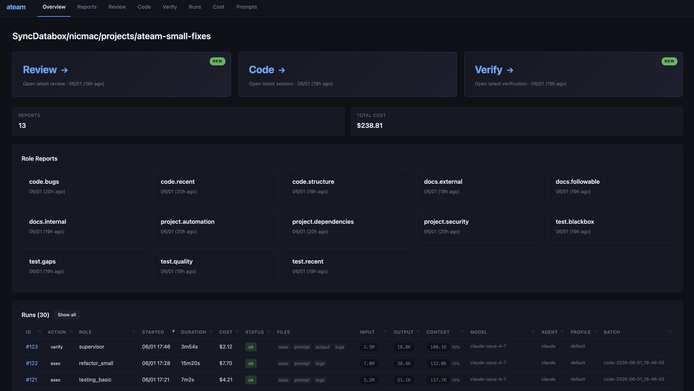
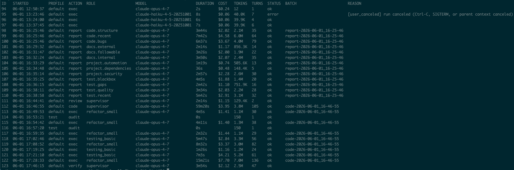

# ATeam

**Run coding agents unattended. Keep your codebase healthy in the background.**

ATeam is a CLI to run existing coding agents (Claude Code, Codex) unattended. It also provides a four-stage software engineering quality pipeline (**report → review → code → verify**) and a library of role prompts covering bugs, tests, security, dependencies, docs, architecture, and more.

It automates the parts you don't want to do to free up your attention for features, architecture or any task you choose to focus on.

## Why ATeam

### The missing quality pipeline

Coding agents prioritize feature completion over long-term software quality, which is a good short-term tradeoff that degrades over time. Tests fall behind, security issues accumulate, code becomes spaghetti, docs go stale, dependencies rot, ...

At the same time, coding agents are good at auditing and fixing quality issues. They can be prompted to be pragmatic: adapt to the project size, small wins are ok, avoid busy work, look for automation opportunities so cost goes down over time, ...

ATeam makes quality-oriented work a one-liner you can run on demand, daily, or on a weekly schedule to keep your codebase healthy. It's useful whether the code is written by agents, humans, or both — humans also forget to add tests, postpone refactors, and neglect security. A consistent automated baseline is a clear win either way.

### Attention is the new bottleneck

Developing new features or the architecture of a project requires a lot of thinking and concentration, interactive agents are a great enabler, helping brainstorm, design, and code extremely quickly. But then the bottleneck becomes your attention.

A growing share of code is written by coding agents. Without automation, humans become full-time reviewers, juggling an ever-growing set of slash commands like `/write-tests /update-docs /update-architecture /simplify /code-review high --fix recent changes` to keep up. Automating this kind of work as a CLI gives some attention back.

Quality work is the sweet spot for unattended agents because it can be prompted once, unlike features that benefit from an interactive session. `ateam resume` turns any past unattended session into an interactive one, so you can talk to the agent that did that refactor last Tuesday night and ask what it did and why.

### `claude -p` works until it doesn't

Coding agents all provide flexible ways to run unattended, but a lot more tooling is required: a uniform interface across agents, conventions for logs, execution profiles, isolation parameters, tracking cost (tokens, turns, context), dynamic prompt assembly, move prompt logic to scripts to reduce costs, ... It doesn't need to be complicated: a few config files, markdown prompts, some log files one CLI.

ATeam gives you the `ateam ps` command for unattended agents: clearly see how long they take and how much they cost, so you can improve your prompts over time, decide what runs daily vs. weekly and not repeatedly run that $20 one-liner without realizing it.

It also gives you `ateam exec` and `ateam parallel` as primitives — drop them into a bash script for simple workflows, or wrap them in something more involved.

This kind of harness lets you invest more heavily in unattended work without becoming dependent on any single coding agent — you keep the flexibility to pick the best pricing or the most interesting features as the landscape shifts.

see more at [APPROACH.md](APPROACH_2.md).

## Key Features

**Agents and isolation**
- Drives Claude Code (`claude -p` with `stream-json`) and Codex (`exec`); experimental `codex-tmux` lets TUI-only commands like `/review` run unattended
- Multiple isolation modes: built-in agent sandbox (default), one-shot Docker, exec into a long-lived container (Docker / devcontainer / compose), or run ateam itself inside Docker (removes all permission checks). This is required to balance permissions vs. safety.
- Config files to manage agent and container invocation, for example profiles select agent + container + custom arguments combos (`--profile docker`, `--profile codex-high`)
- Dynamic prompt assembly with ad-hoc pre/post instruction on top of named prompts, macros in prompts
- Can use the default subscription, oauth, API keys using secret management in OS keychain, prioritizing the cheapest mode if multiple keys are available

**Quality pipeline**
- Four stages: `report` (parallel role audits) → `review` (supervisor prioritizes) → `code` (delegated fixes, small commits) → `verify` (commit inspection + tests). Run as `ateam run-all` or stage-by-stage.
- 11 built-in roles: code bugs, recent-change review, structural quality, system architecture, internal/external docs, project automation, dependencies, security, test gaps, recent-test coverage (see [ROLES.md](ROLES.md))
- Stateful markdown artifacts: each cycle reads the previous reports and review; quality compounds, no context is lost
- 3-level prompt fallback (project `.ateam/` → org `.ateamorg/` → embedded defaults) with composable pre/post extensions; new roles are a single markdown file

**Observability and troubleshooting**
- `ateam ps` — recent runs and their status; `ateam tail` — live agent output
- `ateam inspect EXEC_ID` — full execution details, prompts, and logs; `--auto-debug` runs an agent that reads the failure and proposes a fix
- `ateam resume EXEC_ID`: create an interactive session from an unattended one, ask questions to any past agent
- `ateam cost` — token usage and dollars per run, role, and agent
- `ateam serve` — web UI for browsing all reports, reviews, runs, and costs; `ateam export` for a self-contained HTML snapshot
- `ateam prompt --role NAME` shows the exact assembled prompt; `ateam env` summarizes config and environment

**Agent helpers everywhere**
- `ateam auto-setup`: don't read the docs — ask an agent to select ATeam roles based on your project
- `ateam inspect --auto-debug`: have an agent investigate why past runs failed, recommend config changes, and draft a bug to file against ATeam if needed
- `ateam report --auto-roles`: dynamically select which roles to run based on recent commits
- `scripts/ateam-runall-managed.sh`: run a full quality pipeline and, on error, have an agent try to fix it and resume

## Install

```bash
git clone https://github.com/voidexpr/ateam.git
cd ateam && ./install.sh
```

Authenticate Claude Code or Codex if you haven't already (`claude` / `codex`). For unattended use in cron or containers, see [CONFIG.md](CONFIG.md) for credential storage.

Requires Go 1.26+ (installed automatically by `install.sh`) and one coding agent CLI. Docker optional.

## Quick Start

### 1. Configure ateam for a git workspace
```bash
cd /path/to/your/project
ateam init                # create .ateam/
```

### 2. Select which roles to enable for your project

* A: Edit `.ateam/config.toml` to select which [role](ROLES.md) to enable in your project
* B: Or let an agent decide: `ateam auto-setup` (detect stack, enable a reasonable role set)

### 3. Run the quality pipeline, ATeam commits the changes locally
```bash
ateam run-all                 # report → review → code → verify

# or run one by one:
ateam report         # parallel audit along multiple 'role' dimensions
ateam review         # prioritize the most important findings only
ateam code           # implement the fixes, git commit to the local branch
ateam verify         # verify the commits for bugs, re-run tests
```

### 4. Browse all artifacts in a web browser
```bash
ateam serve               # browse artifacts in your browser
```

That's the whole flow. You can also run `ateam exec` and `ateam parallel` from there for your own scripts.

Once familiar with ateam read [ISOLATION.md](ISOLATION.md) to choose the best balance for your project.

## How it works

`ateam init` creates a `.ateam/` directory in your repo. It holds a small SQLite database tracking agent executions and cost, all logs, and the markdown artifacts produced by roles. You can run `ateam init` anywhere — the CLI walks up parent directories to find it, like `git`.

A second directory, `.ateamorg/` (default: `$HOME/.ateamorg`), holds prompts and configuration you want shared across projects.

Prompts resolve in order: **project → organization → embedded defaults.** You can fully override a prompt at any level, or — more commonly — extend it with a post-prompt fragment. Example: drop `*.post.extra.md` into `.ateam/prompts/report/project.security/` with *"do not flag GitHub Actions secrets, we use a separate vault"* and that instruction is appended every time the role runs.

Full details: [CONFIG.md](CONFIG.md).

`ateam serve`:


`ateam ps`:


## Two ways to use it

#### As a quality pipeline

`ateam run-all` runs the four-stage loop across the [roles](ROLES.md) enabled in `.ateam/config.toml`.

- **report**: role agents audit the codebase in parallel
- **review**: supervisor prioritizes findings into coding tasks
- **code**: coding agents implement the top tasks, commit small changes
- **verify**: supervisor inspects the commits and runs tests

Roles are simple markdown prompt files, you can add your own by dropping a file in `.ateam/prompts/report/`, see [CONFIG.md](CONFIG.md)

#### As a primitive

`ateam exec` and `ateam parallel` run unattended coding agents with your own prompts. Drop them into shell scripts to build any workflow.

```bash
ateam exec "audit recent changes for bugs" --agent codex
ateam parallel "@prompts/security.md" "@prompts/tests.md"
ateam exec --agent claude <<EOF
review findings in $REPORT and apply the fixes
EOF

# observe the agent stream logs of all running processes
ateam tail
```

## Examples

#### Daily pass on recent changes
```bash
ateam run-all --roles code.recent,test.recent
```
Quick, focused, cheap. Good before a PR or as a recurring run.

#### Adversarial review — Codex critiques, Claude implements
```bash
ateam exec "critical review of recent changes into review.md" --agent codex-high
ateam exec "review.md → apply fixes and push back on what you disagree with, commit each separately"  --agent claude-high
```
Two agents, two viewpoints. The CLI primitive lets you compose any pattern in shell.

More complete version of this can be found in:
* `scripts/codex-reviews-claude-codes.sh`: basically what is above but leveraging codex-tmux to call /review which is only available in TUI mode
* `scripts/critical-code-review.sh`: multiple rounds selecting any agent
* `scripts/double-review.sh`: run both codex-tmux /review and claude /code-review in parallel, then merge reports and code the fixes as a 3rd agent run.

#### Background quality on a fast-moving project
```bash
ateam run-all                # end-of-day, in cron, or before commits
```
Roles from `.ateam/config.toml` run unattended. You wake up to small commits to review or merge.

More recipes (lunch-pass / weekly audit / step-by-step / mixed-agent scripts): [GUIDE.md](GUIDE_2.md).

## Isolation

ATeam runs unattended agents that must operate safely without constant permission approval requests. The field is evolving, ATeam supports multiple approaches and will adapt as best practices emerge.

**Why isolation matters:**
- **Filesystem**: prevent accidental or malicious writes outside the project, protect access to sensitive files, avoid time-wasting configuration breakages
- **Network**: prevent data exfiltration (especially combined with filesystem access), prevent remote control

**The tradeoff**: stricter restrictions increase safety but can break tools that rely on directories outside the project, Unix sockets (Docker), pipes (tsx), nested sandboxes (Playwright on macOS), or shared `/tmp` directories. Also more isolation environments like Docker require more configuration, there are also extra steps to configure coding agents within containers.

The exact isolation is configuration driven so highly customizable.

### Execution modes

```
┌─ Host ──────────────────────────────┐   ┌─ Host ──────────────────────────────┐
│ ┌─ ateam ─────────────────────────┐ │   │ ┌─ ateam ─────────────────────────┐ │
│ │ ┌─ agent ─────────────────────┐ │ │   │ │ ┌─ container ─────────────────┐ │ │
│ │ │ ┌─ sandbox ───────────────┐ │ │ │   │ │ │ ┌─ agent ─────────────────┐ │ │ │
│ │ │ │    tools / commands     │ │ │ │   │ │ │ │    tools / commands     │ │ │ │
│ │ │ └─────────────────────────┘ │ │ │   │ │ │ └─────────────────────────┘ │ │ │
│ │ └─────────────────────────────┘ │ │   │ │ └─────────────────────────────┘ │ │
│ └─────────────────────────────────┘ │   │ └─────────────────────────────────┘ │
└─────────────────────────────────────┘   └─────────────────────────────────────┘
① Built-in sandbox — default profile      ② Docker one-shot — --profile docker

┌─ Host ──────────────────────────────┐   ┌─ Host ──────────────────────────────┐
│ ┌─ ateam ─────────────────────────┐ │   │ ┌─ container ─────────────────────┐ │
│ │ ┌─ running container ─────────┐ │ │   │ │ ┌─ ateam ─────────────────────┐ │ │
│ │ │ ┌─ agent ─────────────────┐ │ │ │   │ │ │ ┌─ agent ─────────────────┐ │ │ │
│ │ │ │    tools / commands     │ │ │ │   │ │ │ │    tools / commands     │ │ │ │
│ │ │ └─────────────────────────┘ │ │ │   │ │ │ └─────────────────────────┘ │ │ │
│ │ └─────────────────────────────┘ │ │   │ │ └─────────────────────────────┘ │ │
│ └─────────────────────────────────┘ │   │ └─────────────────────────────────┘ │
└─────────────────────────────────────┘   └─────────────────────────────────────┘
③ Docker exec — --profile docker-exec     ④ ATeam inside Docker or a sandbox — container-native
```

| Approach | How it works | Best for |
|----------|-------------|----------|
| **Built-in sandbox** (default) | OS-level syscall restrictions (Seatbelt/bubblewrap) per command | Most projects — fast, no setup |
| **Built-in sandbox** and **separate agent configuration** | Same as above but don't share the same configuration as interactive agents (different hooks, ...) | Useful when the default agent configuration is highly customized with notifications |
| **Docker one-shot** | Fresh Linux container built and run per command | Strong isolation; need build/test tooling |
| **Docker exec** | Exec into an existing user-managed container (docker-compose, devcontainer, …) | You already run a long-lived dev container |
| **ATeam inside a container** | Run ateam itself from inside a container (Docker or an OS-native sandbox like [fence](https://github.com/fencesandbox/fence)); agents inherit container isolation and runs without any restriction | Docker-native projects or sandbox ateam itself if you don't trust it |
| **None** | No isolation (agent runs directly on host) | Debugging only |

By default ATeam uses the agent's built-in sandbox. Use `--profile docker` for one-shot container isolation or `--profile docker-exec` to exec into an existing container. See `defaults/runtime.hcl` for all profiles.

## Commands

| | |
|---|---|
| **Per project setup** | `init`, `auto-setup` |
| **Pipeline** | `run-all` or: `report`, `review`, `code`, `verify` |
| **Ad-hoc** | `exec`, `parallel` |
| **Process / cost** | `ps`, `tail`, `resume`, `inspect`, `cat`, `cost` |
| **Web Interface for Artifacts** | `serve`, `export` |
| **Config / debug** | `env`, `prompt`, `roles`, `secret` |

Full reference: [COMMANDS.md](COMMANDS.md).


## Note about maturity and cost

ATeam was started in February 2026 and has been used mostly on projects where the code is owned by coding agents (including ateam itself). The approach is validated: it improves codebases and saves attention, projects shape up while spending a fraction of the effort it would take by direct prompting.

But ateam runs are also not free, especially once the mid June 2026 Claude subscription price for unattended-use increases. It still seems well worth it, maybe it is ran less often than every day or with more targeted roles. Built-in prompts have already gone through a round of token usage reduction but more will be done in the future to reduce token usage. A core realization while working with coding agents is that the cost of building features might not even be half of the true cost of building quality software.

## Docs

- [GUIDE.md](GUIDE_2.md) — recipes, role tuning, when (not) to use ateam
- [APPROACH.md](APPROACH_2.md) — rationale, positioning, how ateam compares to other frameworks
- [CONFIG.md](CONFIG.md) — directory layout, prompt overrides, runtime profiles
- [ISOLATION.md](ISOLATION.md) — sandbox and container modes
- [ROLES.md](ROLES.md) — built-in role catalog
- [FAQ.md](FAQ.md)
- [DEV.md](DEV.md) — development setup, testing, internals
